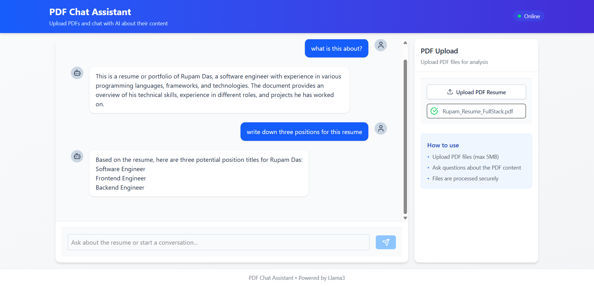

# 📚 PDF Chat Assistant

A sleek AI-powered web app that lets you **chat with your PDFs** using cutting-edge LLMs like **Llama3** and **Mixtral**, via **Groq** and **Ollama**.

> Upload any PDF, ask questions, get smart contextual answers — like ChatGPT for your files!

---



---

## 🌐 Live Demo

| 🖥 Frontend                                                                   | 📚 API Docs                                                                            |
| ---------------------------------------------------------------------------- | -------------------------------------------------------------------------------------- |
| [chatapp-client-xs77.onrender.com](https://chatapp-client-xs77.onrender.com) | [chatapp-server-jeiz.onrender.com/docs](https://chatapp-server-jeiz.onrender.com/docs) |

---

## ✨ Features

- 🧠 AI-powered chat using **Llama3** or **Mixtral**
- 🔄 Model switching between **Groq** (cloud) and **Ollama** (local)
- 📄 Upload and extract text from PDF files
- 💬 Real-time chat with conversation memory
- 🎨 Beautiful and responsive UI
- 🛡️ Secure file handling
- ⚡ High-performance backend with **Bun** + **Elysia**

---

## 🧑‍💻 Tech Stack

| Frontend                          | Backend                        | Infra               |
| --------------------------------- | ------------------------------ | ------------------- |
| React + TypeScript + TailwindCSS  | Bun + Elysia.js + LangGraph    | Docker + Render.com |
| Vite, SWR, React Markdown, TipTap | PDF parser, Groq & Ollama LLMs | Docker Compose      |

---

## 🚀 Screenshots

### 📄 Upload PDF


### 🤖 AI Chat in Action


### 🔁 Model Switching


---

## 🧭 How It Works

```mermaid
graph TD
  A[User uploads PDF] --> B[Backend extracts text]
  B --> C[User sends question]
  C --> D[Backend forwards prompt to selected model]
  D --> E[LLM (Groq or Ollama)]
  E --> F[Model responds with answer]
  F --> G[Response shown in UI]
```

---

## ⚙️ Setup Guide

### 📦 Requirements

- Node.js 20+
- Bun runtime
- Docker + Docker Compose (for full stack)
- Groq API Key (for Groq usage)
- [Ollama](https://ollama.com/) installed (optional for local inference)

---

### 🔧 Local Development

```bash
# Clone repository
git clone https://github.com/rejisterjack/chatapp.git
cd chatapp

# Install dependencies
cd client && bun install      # Frontend
cd ../server && bun install  # Backend

# Run dev servers
cd client && bun run dev     # http://localhost:5173
cd ../server && bun run dev  # http://localhost:8080
```

---

### 🐳 Docker Setup

Run the complete app stack with:

```bash
docker-compose up --build
```

- Frontend: `http://localhost:5173`
- Backend: `http://localhost:8080`
- API Docs: `http://localhost:8080/docs`

---

## 🔐 Environment Variables

### Frontend (`client/.env`)

```env
VITE_API_BASE_URL=http://localhost:8080
```

### Backend (`server/.env`)

```env
PORT=8080
USE_OLLAMA=true
OLLAMA_HOST=http://ollama:11434
GROQ_API_KEY=your-groq-api-key
```

---

## 📡 API Overview

### `GET /`

Health check  
→ `{ "status": "ok" }`

### `GET /api/models`

Returns available models  
→ `["groq", "ollama"]`

### `POST /api/upload`

Upload a PDF  
→ Returns extracted text preview and `conversationId`

### `POST /api/chat`

Send a message to the assistant  
→ `{ response: "Answer from model" }`

---

## 🧠 Model Switching

You can dynamically switch between:

- 🌐 **Groq** (cloud-based) — fast and powerful LLMs like `llama3-8b`
- 🖥️ **Ollama** (local) — run `llama3` or `mixtral` locally

Switch via environment config:

```bash
USE_OLLAMA=true # or false
```

Or by frontend toggle (coming soon 🚧)

---

## 🛠 Folder Structure

```
chatapp/
├── client/       # React frontend
└── server/       # Bun + Elysia backend
```

---

## 🧑‍💻 Contributing

1. Fork the repo
2. Create your feature branch  
   `git checkout -b feature/amazing-feature`
3. Commit your changes  
   `git commit -m "Add amazing feature"`
4. Push and open a PR 🎉

---

## 📄 License

MIT License. See [LICENSE](./LICENSE)

---

Made with ❤️ by [@rejisterjack](https://github.com/rejisterjack)
